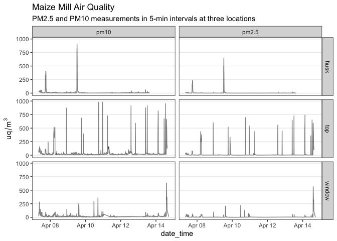
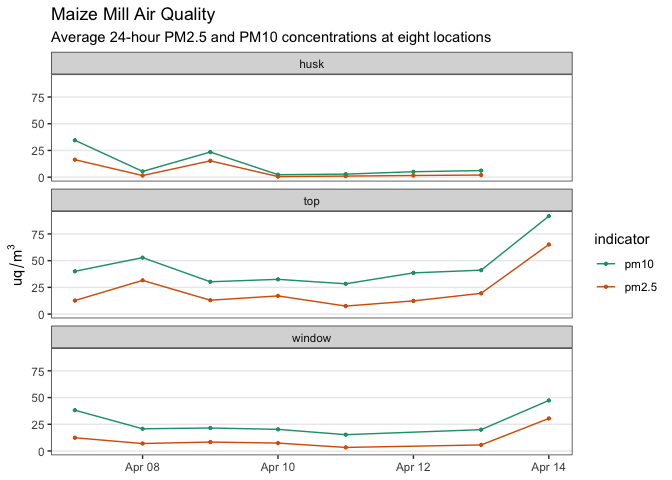
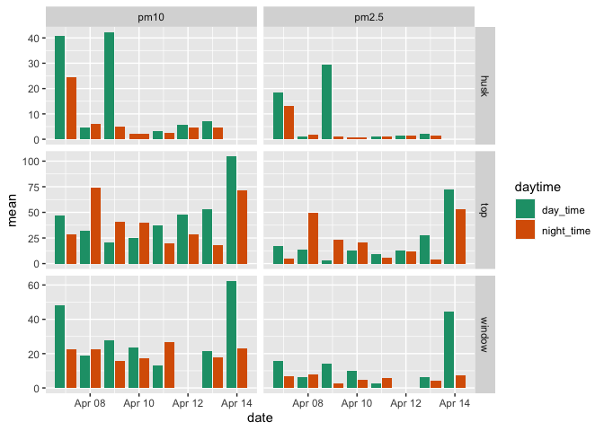
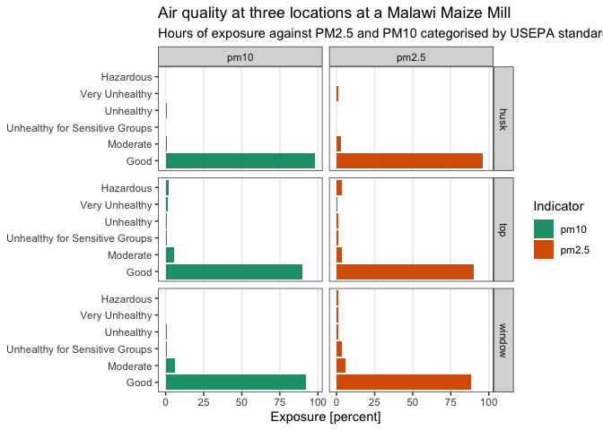
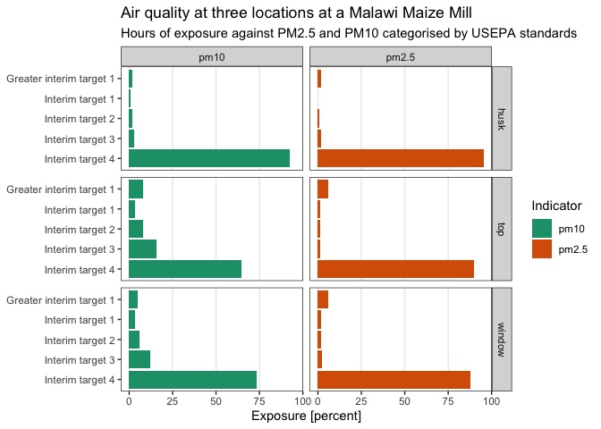
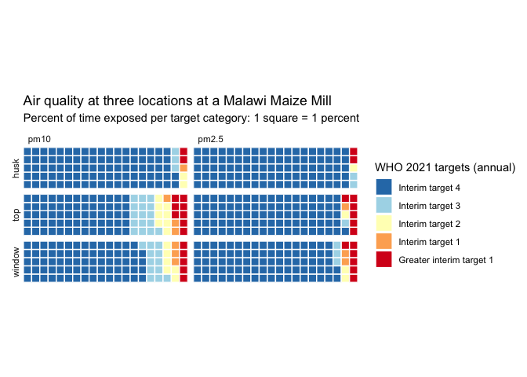

::: cell
:::

::: cell
:::

::: cell
:::

::: cell
:::

# Data Exploration

TODO List:

-   Analyse peaks and exposure times based on the assumption that these
    are the only times that the machines are actually running and
    someone is inside the room

## Plot: Overview

::: cell
::: cell-output-display

:::
:::

## Plot: Daily 24-hour average by date

::: cell
::: cell-output-display

:::
:::

## Plot: Day time vs night time averages (6-18, 18-6)

::: cell
::: cell-output-display

:::
:::

## Plot: Exposure in hours in categories of hazard

### Percent (US EPA)

::: cell
::: cell-output-display

:::
:::

### Percent - [@worldhealthorganization2021who]

::: cell
::: cell-output-display

:::
:::

### Waffle plot - [@worldhealthorganization2021who] (used)

::: cell
::: cell-output-display

:::
:::

## Table: Peaks over the limit for hazardous ([@worldhealthorganization2021who])

-   Peak for PM2.5: \> 35 Greater interim target 1, Annual
-   Peak for PM10: \> 70 Greater interim target 1, Annual
-   Column peaks counts the number of data points (5 minute intervals
    between them) above these two limits over all days

::: cell
::: cell-output-display
  location        n   pm10   pm2.5
  ---------- ------ ------ -------
  husk         1298     21      24
  top          1775    140     108
  window       1407     73      79
:::
:::

## Peaks over 424.9 for pm10 (limit for hazardous (US EPA))

::: cell
::: cell-output-display
  date           hour   mean_pm10
  ------------ ------ -----------
  2021-04-08        5         480
  2021-04-08        6         510
  2021-04-08       22         872
  2021-04-09       12         738
  2021-04-09       18         685
  2021-04-10       17         929
  2021-04-10       23         763
  2021-04-11        6         727
  2021-04-12       13         776
  2021-04-12       14         915
  2021-04-12       20         592
  2021-04-13        9         803
  2021-04-13       12         811
  2021-04-14        2         560
  2021-04-14        3         755
  2021-04-14       11         595
  2021-04-14       12         783
  2021-04-14       14         573
:::
:::

## Peaks over 250.4 for pm2.5 (limit for hazardous (US EPA))

::: cell
::: cell-output-display
  date           hour   mean_pm25
  ------------ ------ -----------
  2021-04-08        4         302
  2021-04-08        5         341
  2021-04-08        6         329
  2021-04-08       22         600
  2021-04-09       12         481
  2021-04-09       18         518
  2021-04-09       20         303
  2021-04-09       21         335
  2021-04-10       17         671
  2021-04-10       23         452
  2021-04-11        5         278
  2021-04-11        6         439
  2021-04-12       13         417
  2021-04-12       14         558
  2021-04-12       20         452
  2021-04-13        9         508
  2021-04-13       12         662
  2021-04-14        2         478
  2021-04-14        3         531
  2021-04-14       11         357
  2021-04-14       12         561
  2021-04-14       14         429
:::
:::
